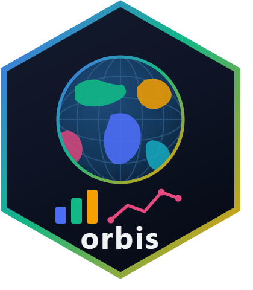
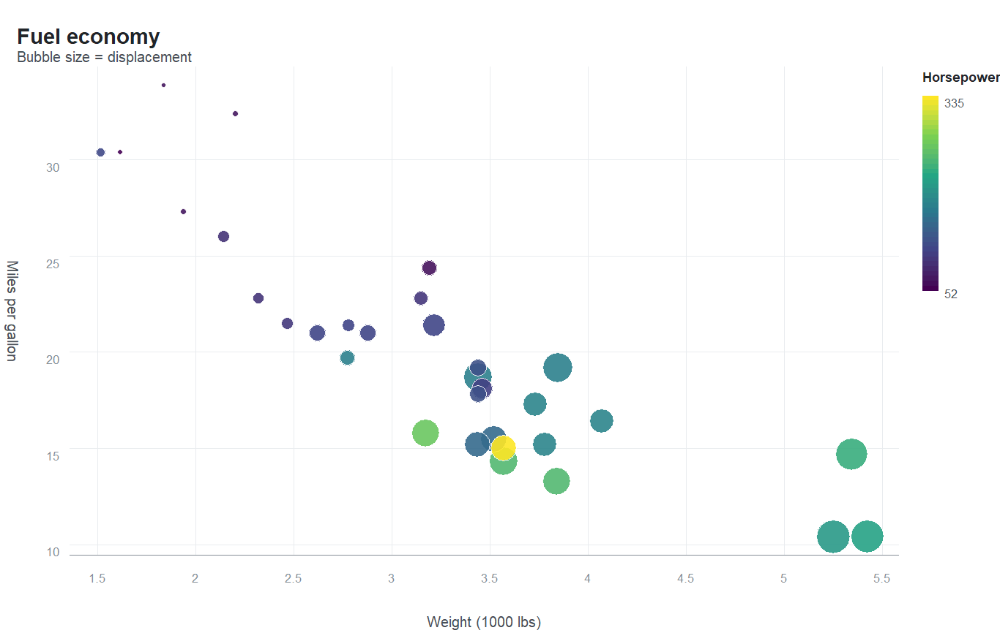
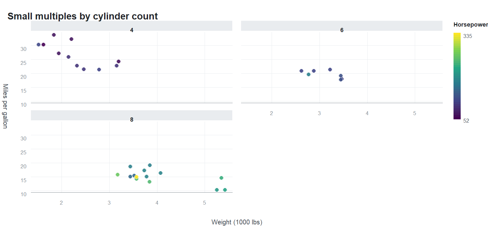

# orbis 

<!-- badges: start -->
[](https://lifecycle.r-lib.org/articles/stages.html#experimental)
[](https://github.com/mqfarooqi1/orbis/actions/workflows/R-CMD-check.yaml)
[](https://CRAN.R-project.org/package=orbis)
[](https://CRAN.R-project.org/package=orbis)
[](https://mqfarooqi1.r-universe.dev/orbis)
[](https://opensource.org/licenses/MIT)
<!-- badges: end -->

**A layered grammar of graphics for R that is interactive by default, sharp at
any resolution, and knows the world map.**

orbis builds a plot from a grammar you already recognise, but instead of
committing to one output it compiles the plot to a **resolution-independent
scene description** and hands that to two renderers:

* a **self-contained SVG writer with embedded JavaScript** — tooltips, hover
  highlighting, mouse-wheel zoom, drag to pan, and clickable legend keys, with
  no JavaScript library and no internet connection required;
* **R's own graphics devices** — publication-quality PNG, TIFF or PDF at any
  resolution you ask for.

Geography is not an add-on. A simplified world polygon dataset ships with the
package, and six map projections — including Equal Earth and an orthographic globe — are built
in.

## Installation

```r
# install.packages("remotes")
remotes::install_github("mqfarooqi1/orbis")
```

orbis imports only base R packages plus `htmltools`.

## A first plot

```r
library(orbis)

orb(mtcars, x = wt, y = mpg, colour = hp, size = disp) +
  orb_points() +
  orb_labs(title = "Fuel economy", x = "Weight (1000 lbs)",
           y = "Miles per gallon", colour = "Horsepower")
```



## The world, built in

```r
orb_worldmap(values = gdp, value_col = "v", projection = "robinson",
             palette = "mako") +
  orb_labs(title = "World choropleth")
```


Switch one argument for a globe:

```r
orb_worldmap(values = gdp, value_col = "v", projection = "orthographic",
             palette = "ember", ocean = "#0B1F33") +
  orb_coord_map("orthographic", centre = c(25, 20)) +
  orb_theme_dark()
```

Projections available: `equirectangular`, `mercator`, `robinson`, `mollweide`,
`equalearth` (the modern equal-area projection of Savric, Patterson & Jenny)
and `orthographic`. Points can be placed on any of them with `orb_geo_points()`.

## Small multiples

```r
orb(mtcars, x = wt, y = mpg, colour = hp) +
  orb_points() +
  orb_facet(cyl) +
  orb_labs(title = "Small multiples by cylinder count")
```



Panels share their scales by default, so they are directly comparable; pass
`scales = "free"` (or `"free_x"` / `"free_y"`) to let each panel stretch to its
own data. Colours and sizes are always resolved across the whole data set, so a
value means the same thing in every panel.

## Interactive, then print-ready — from one object

The same plot object produces both. Nothing is re-specified:

```r
p <- orb(mtcars, x = wt, y = mpg, colour = factor(cyl)) + orb_points()

orb_interactive(p)                  # opens in the viewer: hover, zoom, pan
orb_save(p, "figure.png", dpi = 600) # 600 dpi raster for print
orb_save(p, "figure.pdf")            # vector
orb_save(p, "figure.svg")            # vector, and still interactive
orb_save(p, "figure.html")           # a self-contained interactive page
```

In the interactive output you can hover for a tooltip, scroll to zoom, drag to
pan, double-click to reset, and click a legend key to hide or show that series.

## What is in it

| Function | Purpose |
|---|---|
| `orb()` | Start a plot: data plus a mapping from variables to channels |
| `orb_points()`, `orb_line()`, `orb_bars()`, `orb_area()`, `orb_text()` | Layers |
| `orb_map()`, `orb_geo_points()`, `orb_worldmap()` | Geographic layers |
| `orb_coord_map()` | Six map projections, including Equal Earth and an orthographic globe |
| `orb_facet()` | Small multiples: one panel per level, shared or free scales |
| `orb_scale_colour()`, `orb_scale_fill()`, `orb_scale_size()`, `orb_scale_x()`, `orb_scale_y()` | Scales, limits, log and square-root axes |
| `orb_theme_light()`, `orb_theme_dark()`, `orb_theme_minimal()`, `orb_theme_ink()` | Themes |
| `orb_save()`, `orb_svg()`, `orb_interactive()`, `orb_draw()` | Output |
| `orb_palettes()` | Perceptually uniform and qualitative palettes |
| `world_map` | Simplified world polygons, 229 regions |

## Honest limitations

orbis is young, and it is not a drop-in replacement for a mature plotting
package. In particular:

* **No statistical layers.** There is no smoother, no boxplot and no histogram
  geometry; summarise your data first.
* **Text metrics are approximated** when laying out axes and legends, because
  the SVG writer does not query a font engine. Very long labels can be spaced
  imperfectly.
* **The world map is deliberately simplified** for figure-sized output. For
  detailed cartography, or for anything requiring a coordinate reference
  system, use a dedicated spatial package.

## References

* Wickham, H. (2010) "A Layered Grammar of Graphics." *Journal of
  Computational and Graphical Statistics* 19, 3-28.
  [doi:10.1198/jcgs.2009.07098](https://doi.org/10.1198/jcgs.2009.07098)
* Šavrič, B., Patterson, T. & Jenny, B. (2019) "The Equal Earth map
  projection." *International Journal of Geographical Information Science* 33,
  454-465.
  [doi:10.1080/13658816.2018.1504949](https://doi.org/10.1080/13658816.2018.1504949)
* Crameri, F., Shephard, G. E. & Heron, P. J. (2020) "The misuse of colour in
  science communication." *Nature Communications* 11, 5444.
  [doi:10.1038/s41467-020-19160-7](https://doi.org/10.1038/s41467-020-19160-7)
* Snyder, J. P. (1987) *Map Projections: A Working Manual.* US Geological
  Survey Professional Paper 1395.
  [doi:10.3133/pp1395](https://doi.org/10.3133/pp1395)
* Douglas, D. H. & Peucker, T. K. (1973) "Algorithms for the reduction of the
  number of points required to represent a digitized line or its caricature."
  *Cartographica* 10, 112-122.
  [doi:10.3138/FM57-6770-U75U-7727](https://doi.org/10.3138/FM57-6770-U75U-7727)

World boundaries derive from Natural Earth (public domain), via the `maps`
package.

---

MIT licensed. Muhammad Farooqi.
